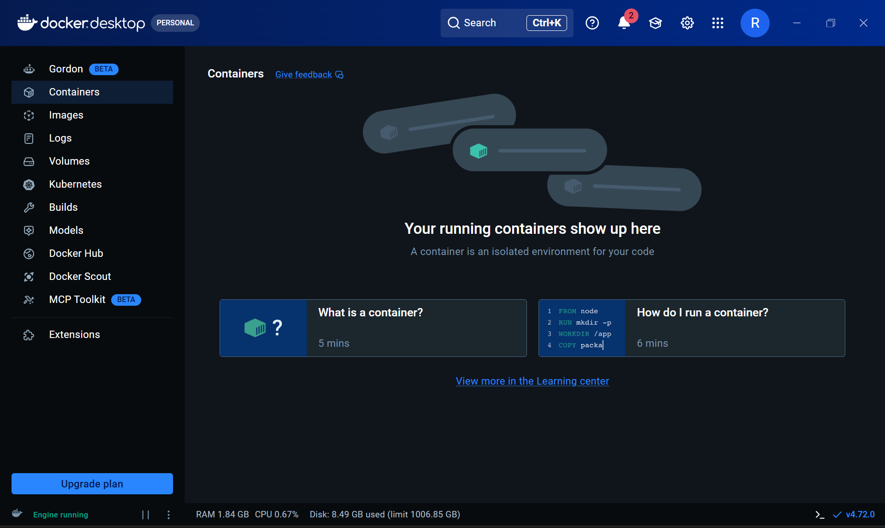

# Minikube Installation Guide

<div align="center">


```
╔══════════════════════════════════════════════════════════════╗
║  🟢 MINIKUBE INSTALLATION                                    ║
║     "Your Local Kubernetes Playground"                       ║
╚══════════════════════════════════════════════════════════════╝
```

</div>

> _"Minikube is like having a tiny Kubernetes cluster sitting right inside your laptop. It's perfect for learning — no cloud bills, no complicated setup, just you and your cluster!"_ — **Rithu** 🧑‍🏫

---

## 📋 What is Minikube?

Minikube is a tool that runs a **single-node Kubernetes cluster** locally on your machine. It's:

- ✅ Free and open-source
- ✅ Runs on Windows, macOS, and Linux
- ✅ Supports multiple drivers (Docker, VirtualBox, Hyper-V, KVM)
- ✅ Perfect for learning and development
- ✅ Includes add-ons like dashboard, Ingress, and metrics-server

---

## 🔧 System Requirements

| Requirement | Minimum                                  | Recommended |
| ----------- | ---------------------------------------- | ----------- |
| **CPU**     | 2 cores                                  | 4+ cores    |
| **RAM**     | 2GB                                      | 4GB+        |
| **Disk**    | 20GB free                                | 50GB+ free  |
| **OS**      | Windows 10+, macOS 10.15+, Ubuntu 18.04+ | Latest      |

---

# 🪟 Windows Installation

## Step 1: Install Docker Desktop

Minikube needs a container runtime. Docker Desktop is the easiest option.

```powershell
# Option A: Using winget (recommended)
winget install Docker.DockerDesktop

# Option B: Using Chocolatey
choco install docker-desktop

# Option C: Manual download
# Go to: https://www.docker.com/products/docker-desktop/
# Download and install the .exe
```

**After installation:**

1. Restart your computer
2. Open Docker Desktop
3. Wait for it to start (green icon in system tray)
4. Enable "Use the Windows Subsystem for Linux 2" if prompted

📸 **Screenshot Placeholder:** _[Docker Desktop running on Windows]_


```powershell
# Verify Docker is running
docker --version
# Expected: Docker version 24.x.x, build xxxxxxx

docker run hello-world
# Expected: "Hello from Docker!" message
```

> 💡 **Rithu's Tip:** _"If Docker Desktop shows an error about WSL2, you need to enable Windows Subsystem for Linux. Open PowerShell as Admin and run: wsl --install"_

---

## Step 2: Install kubectl

```powershell
# Option A: Using winget (recommended)
winget install Kubernetes.kubectl

# Option B: Using Chocolatey
choco install kubernetes-cli

# Option C: Manual download
# Go to: https://kubernetes.io/docs/tasks/tools/install-kubectl-windows/
# Download kubectl.exe and add to your PATH
```

```powershell
# Verify kubectl
kubectl version --client
# Expected: Client Version: version.Info{Major:"1", Minor:"28"...}
```

---

## Step 3: Install Minikube

```powershell
# Option A: Using winget (recommended)
winget install Kubernetes.minikube

# Option B: Using Chocolatey
choco install minikube

# Option C: Manual download
# Go to: https://minikube.sigs.k8s.io/docs/start/windows/
# Download minikube.exe and add to your PATH
```

```powershell
# Verify Minikube
minikube version
# Expected: minikube version: v1.32.x
```

---

## Step 4: Start Minikube

```powershell
# Start with Docker driver (recommended)
minikube start --driver=docker

# Or with more resources
minikube start --driver=docker --memory=4096 --cpus=2
```

**Expected output:**

```
* Using the docker driver based on existing profile
* Starting control plane node minikube in cluster minikube
* Pulling base image...
* Preparing Kubernetes v1.28.3 on Docker 24.0.7...
* Verifying Kubernetes components...
* kubectl not configured. To fix: minikube update-context
* Done! kubectl is now configured to use "minikube" cluster
```

📸 **Screenshot Placeholder:** _[Minikube started successfully on Windows]_

---

## Step 5: Verify Installation

```powershell
# Check cluster info
kubectl cluster-info
# Expected: Kubernetes control plane is running at https://...

# Check nodes
kubectl get nodes
# Expected: NAME STATUS ROLES AGE VERSION
#           minikube Ready control-plane ... v1.28.x
```

🎉 **Congratulations! Minikube is installed on Windows!**

---

# 🍎 macOS Installation

## Step 1: Install Homebrew (if not installed)

```bash
# Check if Homebrew is installed
brew --version

# If not, install it
/bin/bash -c "$(curl -fsSL https://raw.githubusercontent.com/Homebrew/install/HEAD/install.sh)"
```

---

## Step 2: Install Docker Desktop

```bash
# Using Homebrew
brew install --cask docker

# Or manual download
# Go to: https://www.docker.com/products/docker-desktop/
```

**After installation:**

1. Open Docker Desktop from Applications
2. Wait for it to start
3. Grant necessary permissions

📸 **Screenshot Placeholder:** _[Docker Desktop running on macOS]_

```bash
# Verify Docker
docker --version
docker run hello-world
```

---

## Step 3: Install kubectl

```bash
# Using Homebrew
brew install kubectl

# Or using curl
curl -LO "https://dl.k8s.io/release/$(curl -L -s https://dl.k8s.io/release/stable.txt)/bin/darwin/amd64/kubectl"
chmod +x kubectl
sudo mv kubectl /usr/local/bin/
```

```bash
# Verify kubectl
kubectl version --client
```

---

## Step 4: Install Minikube

```bash
# Using Homebrew
brew install minikube

# Or using curl
curl -LO https://storage.googleapis.com/minikube/releases/latest/minikube-darwin-amd64
chmod +x minikube-darwin-amd64
sudo mv minikube-darwin-amd64 /usr/local/bin/minikube
```

```bash
# Verify Minikube
minikube version
```

---

## Step 5: Start Minikube

```bash
# Start with Docker driver
minikube start --driver=docker

# Or with more resources
minikube start --driver=docker --memory=4096 --cpus=2
```

📸 **Screenshot Placeholder:** _[Minikube started successfully on macOS]_

---

## Step 6: Verify Installation

```bash
kubectl cluster-info
kubectl get nodes
# Expected: minikube Ready control-plane ... v1.28.x
```

🎉 **Congratulations! Minikube is installed on macOS!**

---

# 🐧 Linux / EC2 Installation

## Step 1: Install Docker

```bash
# Update package index
sudo apt-get update

# Install Docker
sudo apt-get install -y docker.io

# Start and enable Docker
sudo systemctl enable docker
sudo systemctl start docker

# Add your user to docker group (avoid using sudo)
sudo usermod -aG docker $USER

# Log out and back in for group changes to take effect
# Or run: newgrp docker
```

```bash
# Verify Docker
docker --version
docker run hello-world
```

> 💡 **Rithu's Tip:** _"On EC2, make sure your instance has at least 2 vCPU and 4GB RAM. t3.medium is a good choice!"_

📸 **Screenshot Placeholder:** _[Docker running on Ubuntu/EC2]_

---

## Step 2: Install kubectl

```bash
# Download kubectl
curl -LO "https://dl.k8s.io/release/$(curl -L -s https://dl.k8s.io/release/stable.txt)/bin/linux/amd64/kubectl"

# Make it executable
chmod +x kubectl

# Move to PATH
sudo mv kubectl /usr/local/bin/
```

```bash
# Verify kubectl
kubectl version --client
```

---

## Step 3: Install Minikube

```bash
# Download Minikube
curl -LO https://storage.googleapis.com/minikube/releases/latest/minikube-linux-amd64

# Make it executable
chmod +x minikube-linux-amd64

# Move to PATH
sudo mv minikube-linux-amd64 /usr/local/bin/minikube
```

```bash
# Verify Minikube
minikube version
```

---

## Step 4: Start Minikube

```bash
# Start with Docker driver
minikube start --driver=docker

# Or with more resources
minikube start --driver=docker --memory=4096 --cpus=2
```

📸 **Screenshot Placeholder:** _[Minikube started successfully on Linux/EC2]_

---

## Step 5: Verify Installation

```bash
kubectl cluster-info
kubectl get nodes
# Expected: minikube Ready control-plane ... v1.28.x
```

🎉 **Congratulations! Minikube is installed on Linux/EC2!**

---

# 🔧 Common Minikube Commands

```bash
# Start Minikube
minikube start

# Stop Minikube (preserves state)
minikube stop

# Delete Minikube (removes everything)
minikube delete

# Check status
minikube status

# Get the cluster IP
minikube ip

# Open the dashboard
minikube dashboard

# SSH into the node
minikube ssh

# Enable an add-on
minikube addons enable dashboard
minikube addons enable ingress
minikube addons enable metrics-server

# List all add-ons
minikube addons list

# Mount a local directory
minikube mount /path/to/local/dir

# Get the service URL
minikube service <service-name> --url
```

---

# 🆘 Troubleshooting

### "Docker is not running"

```bash
# Windows/macOS: Start Docker Desktop
# Linux:
sudo systemctl start docker
```

### "minikube start fails with memory error"

```bash
# Allocate more memory
minikube start --memory=4096 --cpus=2

# Or in Docker Desktop:
# Settings → Resources → Increase Memory to 4GB+
```

### "kubectl cannot connect to cluster"

```bash
# Make sure Minikube is running
minikube status

# If not, start it
minikube start

# Check kubectl context
kubectl config current-context
# Should show: minikube

# Switch context if needed
kubectl config use-context minikube
```

### "Permission denied on Linux"

```bash
# Add your user to the docker group
sudo usermod -aG docker $USER
# Then log out and back in
```

### "Minikube stuck in 'Starting'"

```bash
# Delete and recreate
minikube delete
minikube start --driver=docker
```

---

## ✅ Verification Checklist

```bash
# 1. Docker is running
docker --version
docker run hello-world

# 2. kubectl is installed
kubectl version --client

# 3. Minikube is installed
minikube version

# 4. Cluster is running
minikube start
kubectl cluster-info
kubectl get nodes
```

---

## 🚀 Next Steps

Once Minikube is installed, you're ready to start the labs!

```
cd ../..
cd "01 - Minikube and kubectl Setup"
cat README.md
```

**[Start Lab 01 →](../../01 - Minikube and kubectl Setup/README.md)**

---

<div align="center">

```
╔══════════════════════════════════════════════════════════════╗
║                                                              ║
║  🎉 Minikube is ready! Your Kubernetes playground is live!  ║
║     Time to start breaking things (safely)! 🚀             ║
║                                                              ║
╚══════════════════════════════════════════════════════════════╝
```

</div>

_Made with ❤️ by Rithu — "Welcome to the world of Kubernetes!"_ 🧑‍🏫
