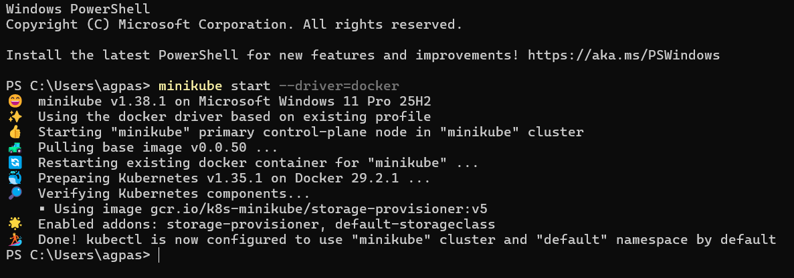
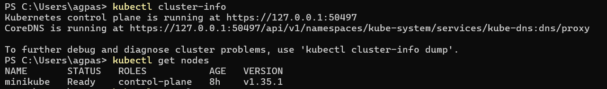
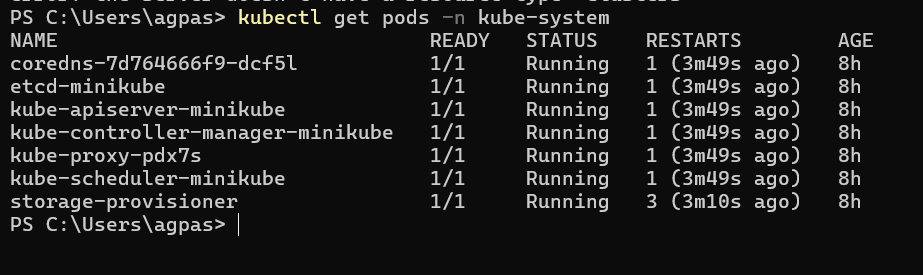
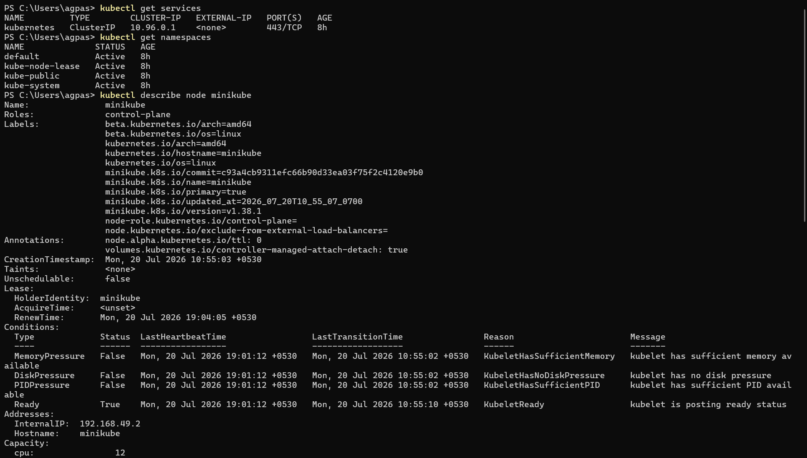
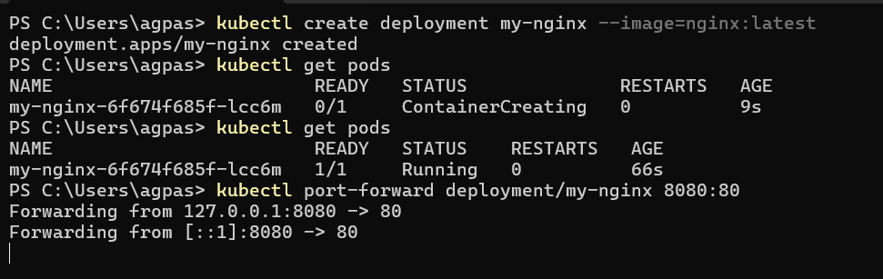
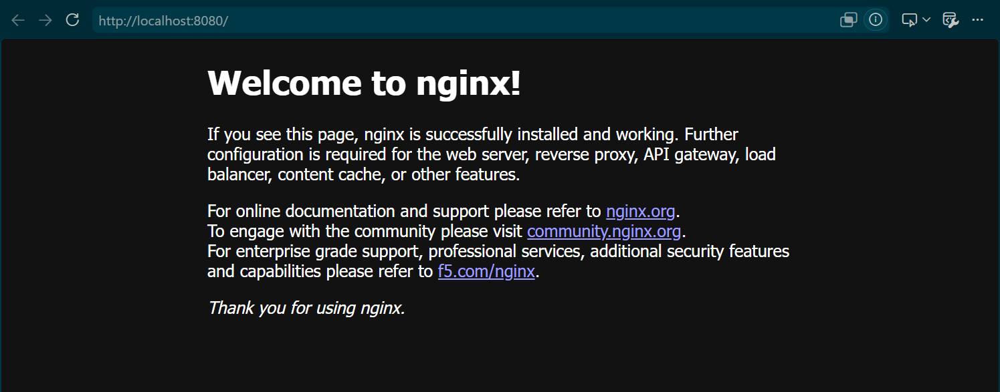
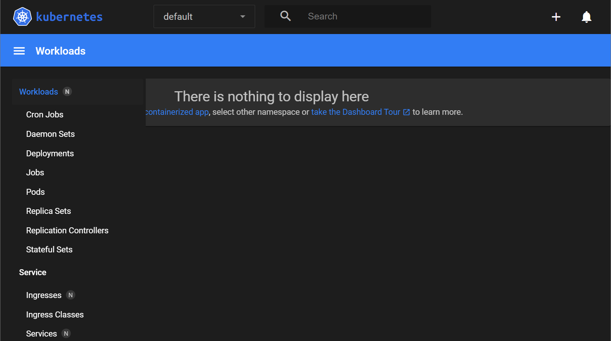
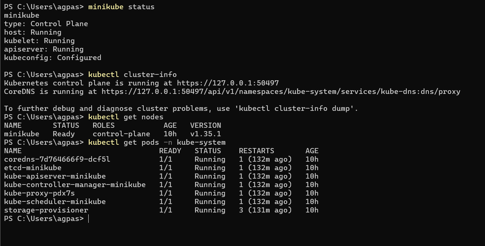

# Lab 01 — Minikube & kubectl Setup

<div align="center">


```
╔══════════════════════════════════════════════════════════════╗
║  Lab 01 — Minikube & kubectl Setup                          ║
║  "Your First Step into the Kubernetes Universe"             ║
╚══════════════════════════════════════════════════════════════╝
```

</div>

> _"Everyone starts somewhere. For some, it's a 'Hello World' program. For us, it's spinning up our own Kubernetes cluster. No pressure!"_ — **Rithu** 🧑‍🏫

---

## 🎯 Objective

By the end of this lab, you will:

- ✅ Have Minikube installed and running on your machine
- ✅ Have kubectl configured to talk to your cluster
- ✅ Understand the basic architecture of a Kubernetes cluster
- ✅ Be able to verify your cluster health like a pro

---

## 🧠 Prerequisites

- [ ] Docker Desktop installed and running
- [ ] kubectl installed (see [PREREQUISITES.md](../PREREQUISITES.md))
- [ ] Minikube installed
- [ ] At least 2GB of free RAM

> 💡 **Rithu's Tip:** _"If you haven't installed the tools yet, stop here and go to PREREQUISITES.md. I'll wait!"_

---

## 💰 Cost Warning

```
💵 COST: $0.00 — This lab uses Minikube (local cluster)
⏱️  No cloud resources = No charges
🎯 Perfect for learning without worrying about bills!
```

> _"The best kind of cloud bill is a $0 cloud bill. Minikube agrees."_ — **Rithu** 🧑‍🏫

---

## 🏗️ Architecture

Here's what we're building today:

```
┌─────────────────────────────────────────────────────────┐
│                    YOUR MACHINE                         │
│                                                         │
│  ┌─────────────────────────────────────────────────┐   │
│  │              Minikube Cluster                    │   │
│  │                                                  │   │
│  │  ┌──────────────────────────────────────────┐   │   │
│  │  │         Kubernetes Node                  │   │   │
│  │  │                                          │   │   │
│  │  │  ┌────────────┐  ┌────────────────────┐  │   │   │
│  │  │  │  API       │  │  etcd              │  │   │   │
│  │  │  │  Server    │  │  (Key-Value Store) │  │   │   │
│  │  │  └────────────┘  └────────────────────┘  │   │   │
│  │  │                                          │   │   │
│  │  │  ┌────────────┐  ┌────────────────────┐  │   │   │
│  │  │  │  Scheduler  │  │  Controller       │  │   │   │
│  │  │  │             │  │  Manager          │  │   │   │
│  │  │  └────────────┘  └────────────────────┘  │   │   │
│  │  │                                          │   │   │
│  │  │  ┌────────────────────────────────────┐  │   │   │
│  │  │  │         kubelet + kube-proxy       │  │   │   │
│  │  │  └────────────────────────────────────┘  │   │   │
│  │  └──────────────────────────────────────────┘   │   │
│  └─────────────────────────────────────────────────┘   │
│                                                         │
│  ┌─────────────────────────────────────────────────┐   │
│  │              kubectl (CLI)                       │   │
│  │  ─────────────────────────────────────────────   │   │
│  │  You type commands here → API Server processes   │   │
│  └─────────────────────────────────────────────────┘   │
└─────────────────────────────────────────────────────────┘
```

---

## 🛠️ Step-by-Step Instructions

### Step 1: Start Minikube

Let's fire up our Kubernetes cluster! 🚀

```bash
# Start Minikube with Docker driver
minikube start --driver=docker
```

You should see output like:

```
* Using the docker driver based on existing profile
* Starting control plane node minikube in cluster minikube
* Pulling base image...
* Preparing Kubernetes v1.28.3 on Docker 24.0.7...
  - kubelet ⌛
  - control plane ⌛
  - coredns ⌛
  - etcd ⌛
  - podman 🪣  & 🐳 (container networking)
  - autoscaler 🔧
  - dashboard 🔧
  - metrics-server 🔧
* Verifying Kubernetes components...
  - Using image gcr.io/k8s-minikube/storage-provisioner:v5
* kubectl not configured. To fix: minikube update-context
* Done! kubectl is now configured to use "minikube" cluster
```

📸 **Screenshot Placeholder:** _[Terminal showing minikube start output]_


> 💡 **Rithu's Tip:** _"The first start takes a few minutes as it pulls the base image. Subsequent starts are much faster — like upgrading from dial-up to broadband!"_

---

### Step 2: Verify the Cluster

Let's make sure our cluster is healthy:

```bash
# Check cluster info
kubectl cluster-info
```

Expected output:

```
Kubernetes control plane is running at https://127.0.0.1:XXXXX
CoreDNS is running at https://127.0.0.1:XXXXX/api/v1/namespaces/kube-system/services/kube-dns:dns/proxy

To further debug and diagnose cluster problems, use 'kubectl cluster-info dump'.
```

```bash
# Check cluster nodes
kubectl get nodes
```

Expected output:

```
NAME       STATUS   ROLES           AGE   VERSION
minikube   Ready    control-plane   30s   v1.28.3
```

📸 **Screenshot Placeholder:** _[Terminal showing kubectl get nodes output]_


> 💡 **Rithu's Tip:** _"That single 'Ready' node is your entire Kubernetes cluster right now. In production, you'd have many nodes — but hey, Rome wasn't built in a day!"_

---

### Step 3: Explore the Cluster Components

Let's look at what's running inside the cluster:

```bash
# Check all pods in kube-system namespace
kubectl get pods -n kube-system
```

Expected output:

```
NAME                               READY   STATUS    RESTARTS   AGE
coredns-5dd5756b68-4xxxx          1/1     Running   0          1m
etcd-minikube                      1/1     Running   0          1m
kube-apiserver-minikube            1/1     Running   0          1m
kube-controller-manager-minikube   1/1     Running   0          1m
kube-proxy-xxxxx                   1/1     Running   0          1m
kube-scheduler-minikube            1/1     Running   0          1m
storage-provisioner                1/1     Running   0          1m
```

These are the **control plane components** — the brain of your cluster! 🧠

📸 **Screenshot Placeholder:** _[Terminal showing kube-system pods]_


---

### Step 4: Explore kubectl Commands

Let's learn some essential kubectl commands:

```bash
# List all services
kubectl get services
```

Expected output:

```
NAME         TYPE        CLUSTER-IP   EXTERNAL-IP   PORT(S)   AGE
kubernetes   ClusterIP   10.96.0.1    <none>        443/TCP   1m
```

```bash
# List all namespaces
kubectl get namespaces
```

Expected output:

```
NAME              STATUS   AGE
default           Active   1m
kube-node-lease   Active   1m
kube-public       Active   1m
kube-system       Active   1m
```

```bash
# Get detailed node information
kubectl describe node minikube
```

> 💡 **Rithu's Tip:** _"kubectl describe is your best friend when something goes wrong. It gives you the 'medical history' of any Kubernetes resource!"_
> 

---

### Step 5: Run a Test Deployment

Let's deploy something to make sure everything works:

```bash
# Deploy nginx
kubectl create deployment my-nginx --image=nginx:latest
```

```bash
# Check if the pod is running
kubectl get pods
```

Wait for the pod to be in `Running` state:

```
NAME                        READY   STATUS    RESTARTS   AGE
my-nginx-7xxxxxxx-xxxxx    1/1     Running   0          30s
```

📸 **Screenshot Placeholder:** _[Terminal showing nginx pod running]_


> 💡 **Rithu's Tip:** _"If the status says 'ContainerCreating', don't panic! It's just pulling the image. Give it a minute — even Kubernetes needs coffee sometimes."_ ☕

---

### Step 6: Access the Test Deployment

Let's access our nginx server:

```bash
# Port forward to access nginx
kubectl port-forward deployment/my-nginx 8080:80
```

Now open your browser and go to: **http://localhost:8080**

You should see the nginx welcome page! 🎉

📸 **Screenshot Placeholder:** _[Browser showing nginx welcome page]_


```bash
# Stop port-forwarding (Ctrl+C)
```

---

### Step 7: Clean Up the Test

```bash
# Delete the test deployment
kubectl delete deployment my-nginx

# Verify it's gone
kubectl get deployments
```

Expected output:

```
No resources found in default namespace.
```

---

### Step 8: Explore Minikube Dashboard

```bash
# Open the Kubernetes dashboard
minikube dashboard
```

This opens a web-based UI where you can see all your cluster resources visually!

📸 **Screenshot Placeholder:** _[Minikube dashboard in browser]_


> 💡 **Rithu's Tip:** _"The dashboard is great for visual learners. But don't get too attached — in production, you'll probably use tools like Lens, Rancher, or k9s instead."_

---

### Step 9: Learn About Contexts

kubectl can talk to multiple clusters. Let's see how:

```bash
# View current context
kubectl config current-context
```

Expected output:

```
minikube
```

```bash
# List all contexts
kubectl config get-contexts
```

Expected output:

```
CURRENT   NAME       CLUSTER    AUTHINFO    NAMESPACE
*         minikube   minikube   minikube    default
```

```bash
# Get your cluster config details
kubectl config view
```

> 💡 **Rithu's Tip:** _"Think of contexts as bookmarks for different clusters. You can switch between dev, staging, and production clusters with a single command!"_

---

### Step 10: Minikube Useful Commands

Here are some handy Minikube commands to remember:

```bash
# Check Minikube status
minikube status

# Stop the cluster (preserves state)
minikube stop

# Delete the cluster entirely
minikube delete

# Get the cluster's IP address
minikube ip

# SSH into the Minikube node
minikube ssh

# Mount a local directory into the cluster
minikube mount /path/to/local/dir

# Enable an addon
minikube addons enable dashboard

# List all addons
minikube addons list
```

> 💡 **Rithu's Tip:** _"minikube stop is like putting your cluster to sleep. minikube delete is like... well, you know. Use delete wisely!"_ 💀

---

## ✅ Verification

Run these commands to verify everything is working:

```bash
# 1. Cluster is running
minikube status
# Expected: host: Running, kubelet: Running, apiserver: Running

# 2. kubectl can connect
kubectl cluster-info
# Expected: Kubernetes control plane is running at...

# 3. Node is ready
kubectl get nodes
# Expected: NAME STATUS ROLES AGE VERSION
#           minikube Ready control-plane ... v1.28.x

# 4. System pods are healthy
kubectl get pods -n kube-system
# Expected: All pods in Running/Completed state
```

📸 **Screenshot Placeholder:** _[All verification commands showing expected output]_



> _"If all four checks passed, congratulations! You just became a Kubernetes cluster administrator. Put that on your resume!"_ — **Rithu** 🧑‍🏫

---

## 🧹 Cleanup

```bash
# Stop Minikube to free resources
minikube stop

# OR delete Minikube completely (clean slate)
minikube delete
```

> ⚠️ **Note:** Stopping Minikube preserves your cluster state. Deleting it removes everything. For now, stopping is fine!

---

## 📝 What You Learned

| Concept             | Description                                                  |
| ------------------- | ------------------------------------------------------------ |
| **Minikube**        | A tool that runs a single-node Kubernetes cluster locally    |
| **kubectl**         | The command-line tool for interacting with Kubernetes        |
| **Cluster Info**    | How to check your cluster's health and configuration         |
| **Nodes**           | The machines (physical or virtual) that make up a cluster    |
| **kube-system**     | The namespace where Kubernetes control plane components live |
| **Port Forwarding** | How to access services running inside the cluster            |
| **Contexts**        | How kubectl manages connections to multiple clusters         |

---

## 🚀 What's Next?

Now that your cluster is up and running, it's time to learn about the most fundamental building block of Kubernetes:

**[Lab 02: Pods Deep Dive →](../02 - Pods Deep Dive/README.md)**

---

<div align="center">

```
╔══════════════════════════════════════════════════════════════╗
║                                                              ║
║  🎉 You just started your own Kubernetes cluster!           ║
║     That's more than most people ever do!                    ║
║                                                              ║
║  "The journey of a thousand pods begins with a single       ║
║   minikube start." — Ancient Kubernetes Proverb             ║
║                           (just kidding, that's Rithu)      ║
║                                                              ║
╚══════════════════════════════════════════════════════════════╝
```

</div>
