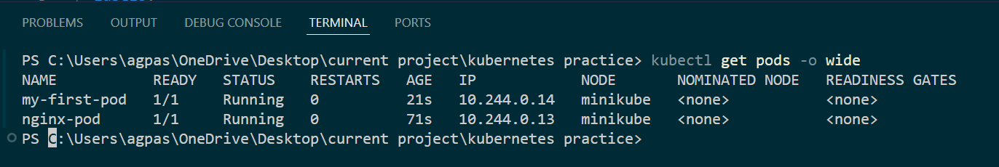
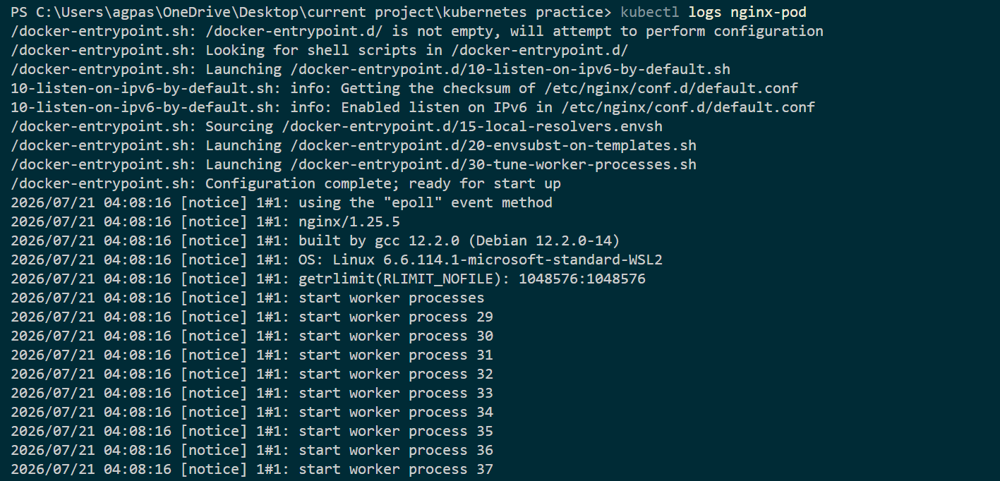
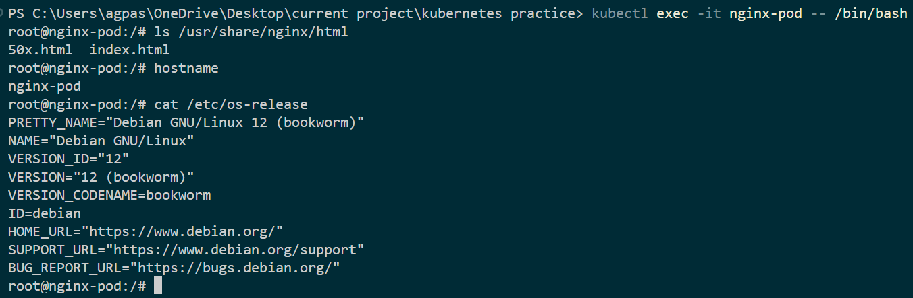
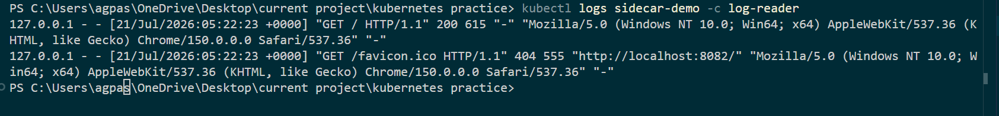

# Lab 02 — Pods Deep Dive

<div align="center">


```
╔══════════════════════════════════════════════════════════════╗
║  Lab 02 — Pods Deep Dive                                    ║
║  "The Smallest Deployable Unit in Kubernetes"               ║
╚══════════════════════════════════════════════════════════════╝
```

</div>

> _"Think of a Pod as a tiny apartment for your containers. Sometimes it's a studio with one container, sometimes it's a shared flat with several. Either way, they share the same network and storage!"_ — **Rithu** 🧑‍🏫

---

## 🎯 Objective

By the end of this lab, you will:

- ✅ Understand what a Pod is and why it exists
- ✅ Create Pods using YAML manifests
- ✅ Use `kubectl describe`, `kubectl logs`, and `kubectl exec`
- ✅ Understand Pod lifecycle and restart policies
- ✅ Work with multi-container pods (sidecar pattern)

---

## 🧠 Prerequisites

- [ ] Completed Lab 01 (Minikube running)
- [ ] kubectl configured and connected to cluster

---

## 💰 Cost Warning

```
💵 COST: $0.00 — Using Minikube (local)
⏱️  No cloud resources involved
```

---

## 🏗️ Architecture

```
┌─────────────────────────────────────────────────────────────┐
│                     KUBERNETES CLUSTER                       │
│                                                              │
│  ┌─────────────────────────────────────────────────────┐    │
│  │                    POD                                │    │
│  │                                                      │    │
│  │  ┌──────────────┐    ┌──────────────┐               │    │
│  │  │  Container 1 │    │  Container 2 │               │    │
│  │  │  (nginx)     │    │  (sidecar)   │  ← Optional   │    │
│  │  │  Port: 80    │    │  Port: 9090  │               │    │
│  │  └──────────────┘    └──────────────┘               │    │
│  │                                                      │    │
│  │  Shared: Network (localhost) + Storage Volumes       │    │
│  └─────────────────────────────────────────────────────┘    │
│                                                              │
│  ┌──────────────┐                                           │
│  │  Pause       │  ← Infra container (handles networking)  │
│  │  Container   │                                           │
│  └──────────────┘                                           │
│                                                              │
└─────────────────────────────────────────────────────────────┘
```

---

## 🛠️ Step-by-Step Instructions

### Step 1: Create Your First Pod (imperative)

```bash
# Create a simple nginx pod using kubectl
kubectl run my-first-pod --image=nginx:latest --port=80
```

```bash
# Check the pod
kubectl get pods
```

Expected output:

```
NAME           READY   STATUS    RESTARTS   AGE
my-first-pod   1/1     Running   0          10s
```

> 💡 **Rithu's Tip:** _"The imperative way (--image=nginx) is great for quick tests, but in the real world, we always use YAML manifests. Let's learn that next!"_

---

### Step 2: Create a Pod Using YAML

Create a file called `my-pod.yaml`:

```bash
# Create the file
cat > my-pod.yaml << 'EOF'
apiVersion: v1
kind: Pod
metadata:
  name: nginx-pod
  labels:
    app: nginx
    environment: learning
    tier: frontend
spec:
  containers:
  - name: nginx
    image: nginx:1.25
    ports:
    - containerPort: 80
    resources:
      requests:
        memory: "64Mi"
        cpu: "250m"
      limits:
        memory: "128Mi"
        cpu: "500m"
    env:
    - name: NGINX_PORT
      value: "80"
EOF
```

```bash
# Apply the YAML
kubectl apply -f my-pod.yaml
```

```bash
# Verify
kubectl get pods -o wide
```

Expected output:

```
NAME        READY   STATUS    RESTARTS   AGE   IP           NODE       NOMINATED NODE
my-first-pod   1/1     Running   0          5m    172.17.0.3   minikube   <none>
nginx-pod      1/1     Running   0          10s   172.17.0.4   minikube   <none>
```

📸 **Screenshot Placeholder:** _[Terminal showing two running pods]_


> 💡 **Rithu's Tip:** _"Notice the labels? They're like tags on a blog post. Labels help Kubernetes organize and select resources. You'll use them A LOT!"_

---

### Step 3: Inspect Your Pod with `kubectl describe`

```bash
# Get detailed info about the pod
kubectl describe pod nginx-pod
```

You'll see a LOT of info. Let's break it down:

```
Name:             nginx-pod
Namespace:        default
Priority:         0
Service Account:  default
Node:             minikube/192.168.49.2
Start Time:       Mon, 01 Jan 2024 12:00:00 +0000
Labels:           app=nginx
                  environment=learning
                  tier=frontend
Status:           Running
IP:               172.17.0.4
Containers:
  nginx:
    Image:          nginx:1.25
    Port:           80/TCP
    State:          Running
    Ready:          True
    Restart Count:  0
    Limits:
      cpu:     500m
      memory:  128Mi
    Requests:
      cpu:     250m
      memory:  64Mi
Events:
  Type    Reason     Age   From               Message
  ----    ------     ----  ----               -------
  Normal  Scheduled  30s   default-scheduler  Successfully assigned default/nginx-pod to minikube
  Normal  Pulling    29s   kubelet            Pulling image "nginx:1.25"
  Normal  Pulled     25s   kubelet            Successfully pulled image "nginx:1.25"
  Normal  Created    25s   kubelet            Created container nginx
  Normal  Started    24s   kubelet            Started container nginx
```

> 💡 **Rithu's Tip:** _"The Events section is gold! It tells you exactly what happened to your pod, step by step. If something's wrong, start here!"_

---

### Step 4: View Pod Logs

```bash
# See the logs from nginx
kubectl logs nginx-pod
```

Expected output:

```
/docker-entrypoint.sh: /docker-entrypoint.d/ is not empty, will attempt to perform configuration
/docker-entrypoint.sh: Looking for shell scripts in /docker-entrypoint.d/
/docker-entrypoint.sh: Launching /docker-entrypoint.d/10-listen-on-ipv6-by-default.sh
...
```

```bash
# Follow logs in real-time (like tail -f)
kubectl logs nginx-pod --follow

# Press Ctrl+C to stop following
```

```bash
# View previous container logs (useful after restarts)
kubectl logs nginx-pod --previous
```

> 💡 **Rithu's Tip:** _"kubectl logs is your debugging MVP. If your pod is crashing, the logs will usually tell you why!"_

📸 **Screenshot Placeholder:** _[Terminal showing nginx logs]_


---

### Step 5: Execute Commands Inside a Pod

```bash
# Open a shell inside the pod
kubectl exec -it nginx-pod -- /bin/bash
```

You're now inside the container! Try:

```bash
# Inside the container:
ls /usr/share/nginx/html/
cat /etc/nginx/nginx.conf
hostname
exit
```

```bash
# Run a command without opening a shell
kubectl exec nginx-pod -- cat /etc/os-release
```

```bash
# Run multiple commands
kubectl exec nginx-pod -- sh -c "echo Hello from inside the pod! && hostname"
```

> 💡 **Rithu's Tip:** _"exec is like SSH-ing into your container. But remember — containers are ephemeral! Anything you create inside (files, etc.) will be lost if the pod restarts."_

📸 **Screenshot Placeholder:** _[Terminal showing exec session inside nginx pod]_


---

### Step 6: Inspect Pod Networking

```bash
# Get the pod's IP address
kubectl get pod nginx-pod -o yaml | grep ip
```

```bash
# Get detailed pod info including IP
kubectl get pod nginx-pod -o wide
```

```bash
# Port-forward to access the pod
kubectl port-forward nginx-pod 8081:80
```

Open **http://localhost:8081** in your browser to see nginx!

```bash
# Stop port-forwarding
# Ctrl+C
```

```bash
# View the pod's environment variables
kubectl exec nginx-pod -- env
```

---

### Step 7: Pod Lifecycle

Let's understand the different states a pod can be in:

```bash
# Watch pod status in real-time
kubectl get pods -w
```

Press `Ctrl+C` to stop watching.

**Pod Phases:**

| Phase         | Description                                                                        |
| ------------- | ---------------------------------------------------------------------------------- |
| **Pending**   | Pod accepted but containers not yet running (pulling image, waiting for scheduler) |
| **Running**   | At least one container is running                                                  |
| **Succeeded** | All containers exited with code 0                                                  |
| **Failed**    | All containers exited, at least one with non-zero code                             |
| **Unknown**   | Pod status couldn't be obtained (usually node communication issue)                 |

> 💡 **Rithu's Tip:** _"If your pod is stuck in 'Pending', it usually means Kubernetes can't schedule it — maybe not enough resources, or a node selector mismatch. describe is your friend here!"_

---

### Step 8: Create a Multi-Container Pod (Sidecar Pattern)

Let's create a pod with two containers sharing the same network:

```bash
cat > multi-container-pod.yaml << 'EOF'
apiVersion: v1
kind: Pod
metadata:
  name: sidecar-demo
  labels:
    app: sidecar
spec:
  containers:
  - name: main-app
    image: nginx:1.25
    ports:
    - containerPort: 80
    volumeMounts:
    - name: shared-logs
      mountPath: /var/log/nginx

  - name: log-reader
    image: busybox:latest
    command: ['sh', '-c', 'tail -f /var/log/nginx/access.log']
    volumeMounts:
    - name: shared-logs
      mountPath: /var/log/nginx

  volumes:
  - name: shared-logs
    emptyDir: {}
EOF
```

```bash
# Apply it
kubectl apply -f multi-container-pod.yaml
```

```bash
# Check the pod is running
kubectl get pods sidecar-demo
```

```bash
# Access nginx from another terminal
kubectl port-forward sidecar-demo 8082:80 &
# Visit http://localhost:8082 in your browser

# Now check the log-reader container's output
kubectl logs sidecar-demo -c log-reader
# You'll see nginx access logs!
```

> 💡 **Rithu's Tip:** _"The sidecar pattern is super powerful! You can use it for logging, monitoring, proxying, and more. Think of it as a helpful assistant living in the same room as your main app."_

📸 **Screenshot Placeholder:** _[Terminal showing log-reader outputting nginx access logs]_


---

### Step 9: Resource Limits and Requests

Let's create a pod with resource constraints:

```bash
cat > resource-limited-pod.yaml << 'EOF'
apiVersion: v1
kind: Pod
metadata:
  name: resource-demo
spec:
  containers:
  - name: stress
    image: polinux/stress:latest
    command: ["stress"]
    args: ["--vm", "1", "--vm-bytes", "100M", "--vm-hang", "0"]
    resources:
      requests:
        memory: "50Mi"
        cpu: "100m"
      limits:
        memory: "150Mi"
        cpu: "500m"
EOF
```

```bash
# Apply and watch
kubectl apply -f resource-limited-pod.yaml
kubectl get pods resource-demo -w
```

> 💡 **Rithu's Tip:** _"Requests = minimum guaranteed resources. Limits = maximum allowed. If a pod exceeds its memory limit, it gets killed (OOMKilled). If it exceeds CPU, it gets throttled."_

---

### Step 10: Delete Pods

```bash
# Delete individual pods
kubectl delete pod my-first-pod
kubectl delete pod nginx-pod
kubectl delete pod sidecar-demo
kubectl delete pod resource-demo

# Delete using YAML file
kubectl delete -f my-pod.yaml

# Verify all pods are gone
kubectl get pods
# Expected: No resources found in default namespace.
```

---

## ✅ Verification

```bash
# 1. Pod creation via imperative
kubectl run test-pod --image=nginx:latest
kubectl get pods
# Expected: test-pod in Running state

# 2. Pod creation via YAML
kubectl apply -f my-pod.yaml
kubectl get pods nginx-pod -o wide

# 3. Logs work
kubectl logs nginx-pod
# Expected: nginx startup logs

# 4. Exec works
kubectl exec nginx-pod -- hostname
# Expected: nginx-pod (or pod name)

# 5. Cleanup
kubectl delete pod test-pod
kubectl delete -f my-pod.yaml
kubectl get pods
# Expected: No resources found
```

---

## 🧹 Cleanup

```bash
# Delete all test pods
kubectl delete pod --all

# Or delete everything in default namespace
kubectl delete all --all

# Verify clean slate
kubectl get all
```

---

## 📝 What You Learned

| Concept              | Description                                                  |
| -------------------- | ------------------------------------------------------------ |
| **Pod**              | The smallest deployable unit in Kubernetes                   |
| **Labels**           | Key-value pairs for organizing and selecting resources       |
| **Pod Status**       | Different phases a pod goes through (Pending, Running, etc.) |
| **kubectl describe** | Detailed information about any resource                      |
| **kubectl logs**     | View container output logs                                   |
| **kubectl exec**     | Execute commands inside running containers                   |
| **Sidecar Pattern**  | Multiple containers sharing the same pod and volumes         |
| **Resource Limits**  | CPU and memory constraints for pods                          |
| **Port Forwarding**  | Access pod services from your local machine                  |

---

## 🚀 What's Next?

Pods are great, but what happens when one dies? That's where ReplicaSets come in:

**[Lab 03: ReplicaSets →](../03 - ReplicaSets/README.md)**

---

<div align="center">

```
╔══════════════════════════════════════════════════════════════╗
║                                                              ║
║  🎉 You now know Pods inside and out!                       ║
║     Containers have nowhere to hide from you now!            ║
║                                                              ║
╚══════════════════════════════════════════════════════════════╝
```

</div>
